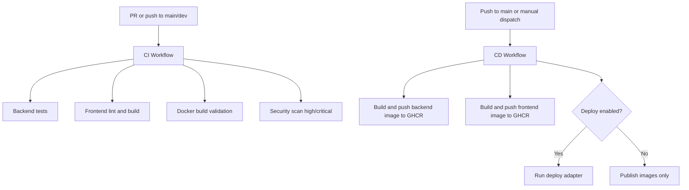

# CI/CD Guide

This project uses GitHub Actions for CI/CD and GitHub Container Registry (GHCR) for container images.

## Workflow Overview



## Workflows

- `/.github/workflows/ci.yml`
  - Triggers: `pull_request`, `push` to `main` and `dev`
  - Required checks:
    - Backend tests (`pytest`)
    - Frontend lint/build (`npm run lint`, `npm run build`)
    - Docker image build validation
  - Security scan policy:
    - Trivy filesystem scan
    - Fails only on `HIGH` and `CRITICAL`

- `/.github/workflows/cd.yml`
  - Triggers:
    - `push` to `main` (publishes images, no auto-deploy by default)
    - `workflow_dispatch` (manual environment/provider deploy)
  - Publishes:
    - `ghcr.io/<org>/<repo>/backend:<sha>`
    - `ghcr.io/<org>/<repo>/frontend:<sha>`
    - Optional mutable tags: `:main`, `:latest`

## Required Secrets and Variables

### Required for CI and CD

- `NEXT_PUBLIC_SUPABASE_URL`
- `NEXT_PUBLIC_SUPABASE_ANON_KEY`
- `NEXT_PUBLIC_API_URL`

### Required for backend tests/runtime config (CI uses safe defaults if omitted)

- `SUPABASE_URL`
- `SUPABASE_KEY`
- `SUPABASE_SERVICE_KEY`
- `SUPABASE_JWT_SECRET`
- `GEMINI_API_KEY`

### Required for GHCR auth

- `GITHUB_TOKEN` (built-in, default)
- `GHCR_PAT` (optional override if org policy requires PAT)

### Deploy adapter placeholders

- `DEPLOY_API_TOKEN`
- `DEPLOY_PROJECT_ID`
- `DEPLOY_SERVICE_ID`
- `DEPLOY_FRONTEND_SERVICE_ID`
- `DEPLOY_VPS_HOST`
- `DEPLOY_VPS_USER`
- `DEPLOY_VPS_SSH_KEY`

Set deploy secrets based on the selected provider.

## Public vs Private Env Mapping

- Public build-time frontend variables:
  - `NEXT_PUBLIC_SUPABASE_URL`
  - `NEXT_PUBLIC_SUPABASE_ANON_KEY`
  - `NEXT_PUBLIC_API_URL`
- Private backend/runtime variables:
  - `SUPABASE_URL`
  - `SUPABASE_KEY`
  - `SUPABASE_SERVICE_KEY`
  - `SUPABASE_JWT_SECRET`
  - `GEMINI_API_KEY`

Never expose private variables via `NEXT_PUBLIC_*`.

## Deployment Adapter Contract

Entrypoint: `/ops/deploy/deploy.sh`

Inputs (env):

- `DEPLOY_PROVIDER` (`render` or `vps`)
- `DEPLOY_ENVIRONMENT` (`staging` or `production`)
- `BACKEND_IMAGE`
- `FRONTEND_IMAGE`
- Optional: `BACKEND_DIGEST`, `FRONTEND_DIGEST`
- Provider-specific `DEPLOY_*` secrets

Expected adapter output lines:

- `DEPLOY_STATUS=<success|failed>`
- `DEPLOY_URL=<url>`

Provider adapters:

- `/ops/deploy/deploy-render.sh`
- `/ops/deploy/deploy-vps.sh`

Both are scaffolds and should be replaced with real API/SSH deployment logic.

## Running CI Locally Before Push

From repository root:

```bash
# Backend tests
python3 -m venv .venv
source .venv/bin/activate
pip install -r backend/requirements.txt
PYTHONPATH=backend pytest backend/tests -q

# Frontend lint/build
cd frontend
npm ci
npm run lint
npm run build
cd ..

# Docker build validation
docker build -f backend/Dockerfile -t siy-backend:local ./backend
docker build \
  -f frontend/Dockerfile \
  --build-arg NEXT_PUBLIC_SUPABASE_URL=https://example.supabase.co \
  --build-arg NEXT_PUBLIC_SUPABASE_ANON_KEY=test-anon-key \
  --build-arg NEXT_PUBLIC_API_URL=http://localhost:8000 \
  -t siy-frontend:local ./frontend
```

## Rollback Procedure (GHCR Digest)

1. Open Actions summary from a successful `CD` run and copy previous image digest(s).
2. Trigger `CD` via `workflow_dispatch`.
3. Set `deploy=true`, choose target environment/provider.
4. In the provider deployment config, pin backend/frontend to known-good digest(s).
5. Confirm health checks (`/health` for backend, frontend route check).

Keep a short rollback log with commit SHA, digests, timestamp, and reason.

## Troubleshooting

- CI fails in `backend-test`:
  - Ensure backend env defaults are valid for tests.
  - Verify no tests require live external services unless explicitly mocked.
- CI fails in `frontend-quality`:
  - Run `npm ci && npm run lint && npm run build` inside `/frontend` locally.
- CI fails in `docker-validate`:
  - Confirm Dockerfiles build with provided args.
- CD fails GHCR push:
  - Verify package write permissions and `GHCR_PAT`/`GITHUB_TOKEN` scope.
- Deploy job fails:
  - Check provider-specific `DEPLOY_*` secrets and adapter output format.

## Branch Protection Recommendation

On GitHub branch protection for `main`, require CI checks before merge:

- `Backend Tests`
- `Frontend Lint & Build`
- `Docker Build Validation`
- `Security Scan`
